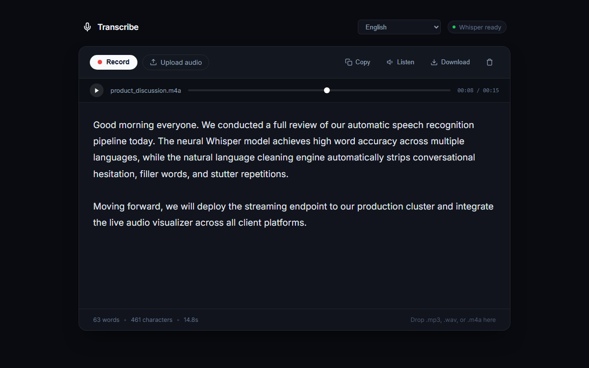
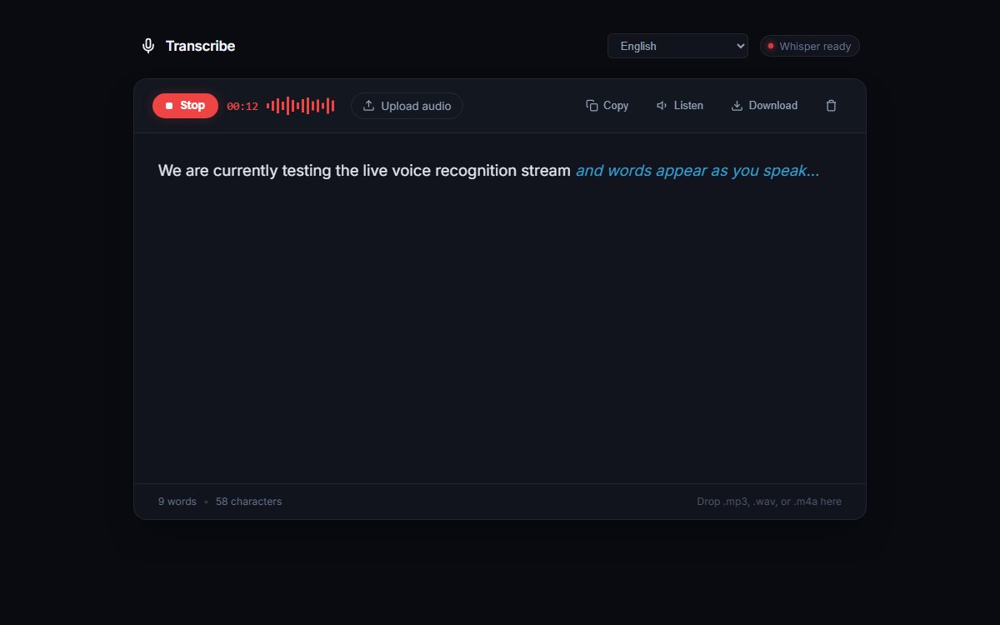

<div align="center">

# 🎙️ Transcribe

**A minimalist, distraction-free speech recognition studio powered by OpenAI Whisper.**  
Real-time live dictation, audio file transcription, and natural language cleaning in a single clean workspace.

<br/>

[](https://python.org)
[](https://fastapi.tiangolo.com)
[](https://github.com/openai/whisper)
[](https://pytorch.org)
[](LICENSE)

<br/>



</div>

<br/>

---

## ⚡ Highlights

| Feature | Description |
| :--- | :--- |
| **🎙️ Real-time Dictation** | Speak into your microphone and see words stream onto the page instantly with zero latency via native Web Speech streaming. |
| **🧠 Neural Whisper Engine** | Upload any audio file or record long-form thoughts; processed locally via OpenAI Whisper's deep neural acoustic model. |
| **✨ Smart Text Cleaner** | Conversational filler words (`um`, `uh`, `you know`, `like`, `basically`), stutter repetitions (`the the`), and hesitation commas are automatically stripped away. |
| **📁 Universal Audio Support** | Drag and drop `.mp3`, `.wav`, `.m4a`, `.flac`, `.ogg`, or `.webm`. In-browser hardware decoding bypasses external `ffmpeg` dependencies. |
| **🎵 Minimal Audio Player** | Scrub through uploaded audio with playback controls and real-time cursor sync. |
| **🔤 Clean Typography** | Distraction-free, editable document canvas inspired by *Linear* and *Notion*. |
| **📋 1-Click Utilities** | Quick actions for **Copy to Clipboard**, **Listen** (Text-to-Speech), and **Download** (`.txt`). |

<br/>

---

## 📸 Interface Preview

<div align="center">

### 🔴 Active Recording & Waveform Stream


*Clean recording state with live timer, dynamic audio frequency bars, and streaming interim speech.*

</div>

<br/>

---

## 🛠️ Tech Stack & Architecture

```
                    ┌────────────────────────────────────────┐
                    │               Browser UI               │
                    │   HTML5 Canvas · Web Audio · Web Speech │
                    └───────────────────┬────────────────────┘
                                        │
                         HTTP / REST    │  WebSocket / WAV Audio
                                        ▼
                    ┌────────────────────────────────────────┐
                    │          FastAPI Web Server            │
                    │        (Python 3.12 + Uvicorn)         │
                    └───────────┬────────────────┬───────────┘
                                │                │
                                ▼                ▼
                     ┌──────────────────┐  ┌──────────────────┐
                     │  OpenAI Whisper  │  │   Clean Engine   │
                     │  (PyTorch / ASR) │  │  (Regex & NLP)   │
                     └──────────────────┘  └──────────────────┘
```

- **Backend Framework**: [FastAPI](https://fastapi.tiangolo.com) for asynchronous, high-throughput REST endpoints.
- **ASR Engine**: [OpenAI Whisper](https://github.com/openai/whisper) (`base` model cached locally for offline accuracy).
- **Audio Processing**: [SoundFile](https://python-soundfile.readthedocs.io) and [SciPy](https://scipy.org) for in-memory 16 kHz PCM resampling.
- **Frontend Architecture**: Pure Vanilla ES6+ & CSS3 with the **Web Audio API** (`AudioContext`, `AnalyserNode`) and **Web Speech API**.

<br/>

---

## 🚀 Quick Start

### 1. Clone & Navigate
```bash
git clone https://github.com/your-username/asr-transcribe.git
cd asr-transcribe
```

### 2. Install Dependencies
```bash
pip install -r requirements.txt
```

### 3. Launch Locally
```bash
python -m uvicorn app:app --host 127.0.0.1 --port 8000
```
Open [**http://localhost:8000**](http://localhost:8000).

---

## 🌐 Deploy to Vercel

This repository is pre-configured with `vercel.json` and optimized for Vercel's Serverless Functions (< 20 MB bundle size, staying far below Vercel's 500 MB limit):

1. **Push your code to GitHub**:
   ```bash
   git add .
   git commit -m "Configure Vercel serverless deployment"
   git push origin main
   ```
2. **Deploy on Vercel**:
   - Go to [vercel.com](https://vercel.com) and click **"Add New Project"**.
   - Import your GitHub repository (`Minimalist-ASR-Voice-Studio`).
   - Click **Deploy** (no build settings changes required!).
   - Done! Your app is live with SSL, global CDN, and free serverless endpoints.

<br/>

---

## 💡 How It Works

1. **Speak**: Click `Record` to start live streaming dictation. Click `Stop` when done.
2. **Upload**: Drag & drop any audio file (`.mp3`, `.wav`, `.m4a`, etc.) directly onto the card.
3. **Auto-Clean**: The built-in cleaner automatically filters hesitation phrases and formats punctuation:
   ```
   Raw Speech:
   "Um basically we should, uh, launch the new feature tomorrow. Make sure the team the team tests it."
   
   Clean Transcript:
   "We should launch the new feature tomorrow. Make sure the team tests it."
   ```
4. **Export**: Click `Copy` to copy text to clipboard, `Listen` to read it aloud, or `Download` to save as a `.txt` file.

<br/>

---

## 📂 Project Structure

```
ASR_main/
├── app.py                # FastAPI backend & transcription router
├── cleaner.py            # Natural language cleaner & filler removal
├── run.bat               # Windows 1-click startup script
├── requirements.txt      # Core Python dependencies
├── screenshot.png        # Product preview screenshot
├── recording_preview.png # Live recording preview screenshot
├── static/
│   ├── index.html        # Minimalist studio interface
│   ├── style.css         # Dark theme & typography styling
│   ├── app.js            # Audio recording, Web Audio & Web Speech logic
│   └── favicon.svg       # Microphone soundwave icon
└── README.md             # Project documentation
```

<br/>

---

<div align="center">
  <sub>Built with Python, FastAPI, and OpenAI Whisper. Minimalist, fast, and private.</sub>
</div>
